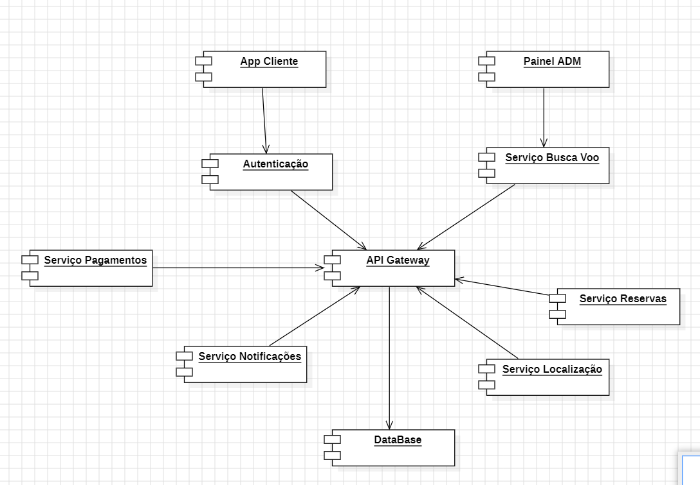

# Arquitetura SOA e requisitos não funcionais

## 1 Problema

"Problema: Sistema de Reservas de Voos com Integração de Serviços SOA Externos Sua equipe foi contratada por uma companhia aérea para desenvolver um sistema de reservas de voos altamente integrado que permitirá aos clientes pesquisar, selecionar e reservar voos. A companhia aérea opera em várias cidades e oferece uma ampla variedade de voos em diferentes horários e destinos. A companhia aérea se mostrou disposta a arcar com os custos de utilização de APIs externas que podem incorporar funcionalidades e expandir o sistema, reduzindo assim a necessidade de desenvolvimento, além de proporcionar uma melhor experiência para o usuário. Os clientes devem ser capazes de pesquisar voos com base em critérios como origem, destino, data e preferências (por exemplo, classe e número de escalas), bem como detectar automaticamente a localização do usuário. Os resultados devem incluir informações sobre os voos disponíveis, horários, preços, duração do voo e disponibilidade de assentos. Os usuários devem poder se cadastrar rapidamente no sistema, fazer suas reservas, fornecendo informações pessoais e de pagamento, e receber confirmações de reserva por e-mail. Os funcionários da companhia aérea devem ter acesso a uma interface de administração para gerenciar voos, disponibilidade de assentos e informações do cliente.

1.  Construa uma arquitetura SOA simples utilizando diagrama de componentes que leve em conta os blocos principais do sistema assim como a integração com os componentes de serviços da arquitetura SOA - Justifique os pontos da sua arquitetura

2.  Liste pelo menos 5 requisitos não funcionais deste sistema justificando a necessidade deste requisito assim como a sua relação ou necessidade dentro da arquitetura SOA"

## 2 Solução

### 2.1 Arquitetura SOA

**A) Camada de Apresentação**
* App Cliente (Web / Mobile)
    * Interface para usuários finais: busca de voos, reservas, cadastro, etc.

**B) Camada de Serviços (SOA)** 
* Serviço de Autenticação e Cadastro
    * Autentica usuários e realiza cadastros.
* Serviço de Busca de Voos
    * Recebe critérios (origem, destino, datas, preferências).
    * Integra com APIs externas de localização e dados de voos.
* Serviço de Reservas
    * Registra reservas com dados do cliente e voo.
    * Gera confirmação por e-mail.
* Serviço de Pagamento (via API Externa)
    * Processa pagamentos com serviços como Stripe, PayPal etc.
* Serviço de Notificações
    * Envia confirmações por e-mail ou SMS.
* Serviço de Localização (via API Externa)
    * Detecta localização do cliente via IP ou GPS.

**C) Camada de Administração**
* Painel de Administração (Web)
    * Usado por funcionários para gerenciar voos e clientes.

**D) Camada de Integração**
* API Gateway
    * Orquestra os serviços internos e externos, tratando a comunicação entre sistemas, transformações de mensagens, segurança e controle de acesso.

**E) Camada de Dados**
* Banco de Dados Relacional
    * Armazena usuários, voos, reservas, histórico de pagamentos etc.

**Justificativas:**
1. Separação por serviços promove alta coesão e baixo acoplamento, princípios fundamentais do SOA.

2. API Gateway centraliza controle e orquestração, permitindo escalabilidade e segurança na comunicação entre serviços.

3.  A integração com serviços externos como geolocalização e pagamento reduz o desenvolvimento interno e oferece mais confiabilidade.

4. O uso de serviços reutilizáveis (ex: notificação, autenticação) melhora a manutenção e reutilização em outros possíveis projetos.

### 2.2 Requisitos Não Funcionais

Para os requisitos não funcionais do sistema, utilizaremos como base a ISO 25010.

| Característica da ISO    | Subcaracterística                 | Requisito Não Funcional                                                                                   | Justificativa / Relação com SOA                                                                 |
|-------------------------------|----------------------------------|-----------------------------------------------------------------------------------------------------------|--------------------------------------------------------------------------------------------------|
| 1. Desempenho | Time Behavior                     | O tempo de resposta da busca de voos deve ser inferior a 2 segundos em 95% dos casos.                    | Reduz latência percebida pelo usuário. SOA permite paralelismo e otimização por serviço.        | 
|               1. Desempenho             | Resource Utilization              | O consumo de CPU e memória por serviço não deve ultrapassar 70% em carga normal.                         | Facilita o dimensionamento e evita gargalos em serviços críticos.                               |
| 2. Confiabilidade       | Availability                      | O sistema deve ter disponibilidade mínima de 99,9% mensal.                                               | Garantia de operação contínua. SOA com replicação e failover por serviço.                       |
|      2. Confiabilidade                         | Fault Tolerance                   | Em caso de falha no serviço de pagamento, o restante do sistema deve continuar operando normalmente.     | Arquitetura SOA permite isolamento de falhas.                                                    |
| 3. Usabilidade          | Learnability                     | Um novo usuário deve conseguir fazer uma reserva completa em até 5 minutos sem ajuda externa.            | Interface clara e lógica. APIs permitem front-ends otimizados.                                 |
|   3. Usabilidade                            | Operability                       | O sistema deve ser utilizável em diferentes dispositivos (desktop, tablet, smartphone).                  | Front-end desacoplado dos serviços via API.                                                      |
| 4. Segurança              | Confidentiality                   | Todos os dados trafegando entre cliente e serviços devem estar criptografados com TLS 1.2 ou superior.  | Proteção de dados pessoais e financeiros. Gateway central facilita controle.                    |
|   4. Segurança                            | Authentication                    | O acesso aos serviços administrativos deve exigir autenticação multifator.                              | Reforça a segurança da área crítica.                                                             |
| 5. Compatibilidade    | Interoperability                  | O sistema deve integrar com serviços externos via RESTful APIs utilizando JSON.                         | Permite fácil comunicação com sistemas de parceiros.                                             |
|       5. Compatibilidade                          | Co-existence                      | O sistema deve poder funcionar paralelamente a sistemas legados durante o período de transição.          | SOA facilita substituição gradual de componentes.                                                |
| 6. Manutenibilidade  | Modularity                        | Cada serviço deve ser implementado como componente isolado, com deploy e manutenção independentes.       | Facilita manutenção e atualizações sem impacto geral.                                            |
|        6. Manutenibilidade                        | Modifiability                     | Mudanças em um serviço (ex: regras de reserva) não devem afetar os demais.                              | SOA favorece o baixo acoplamento.                                                               |
| 7. Portabilidade       | Adaptability                      | O sistema deve funcionar em diferentes ambientes de nuvem (AWS, Azure, etc).                            | Serviços contêinerizados facilitam a adaptação.                                                  |
|       7. Portabilidade                        | Installability                    | O sistema deve poder ser implantado com scripts automatizados em menos de 15 minutos.                    | Facilita CI/CD em ambientes SOA.                                                                |

